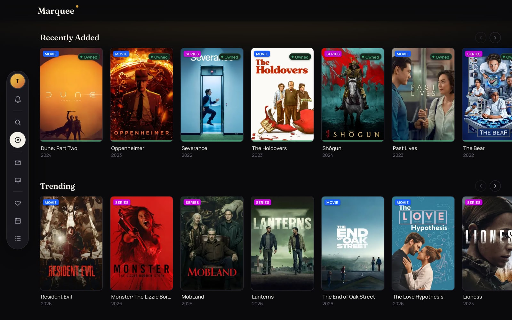
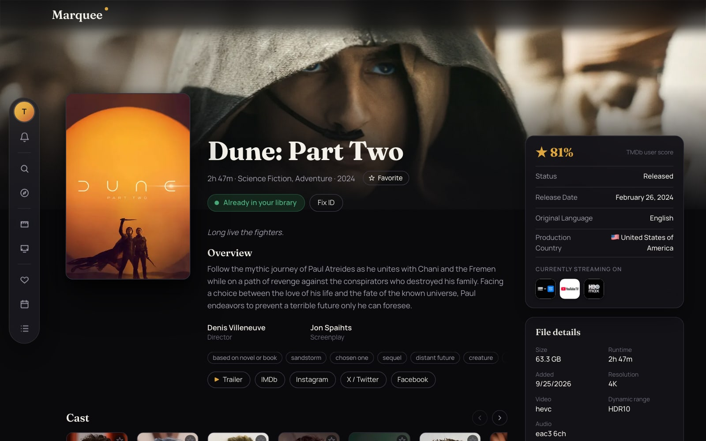
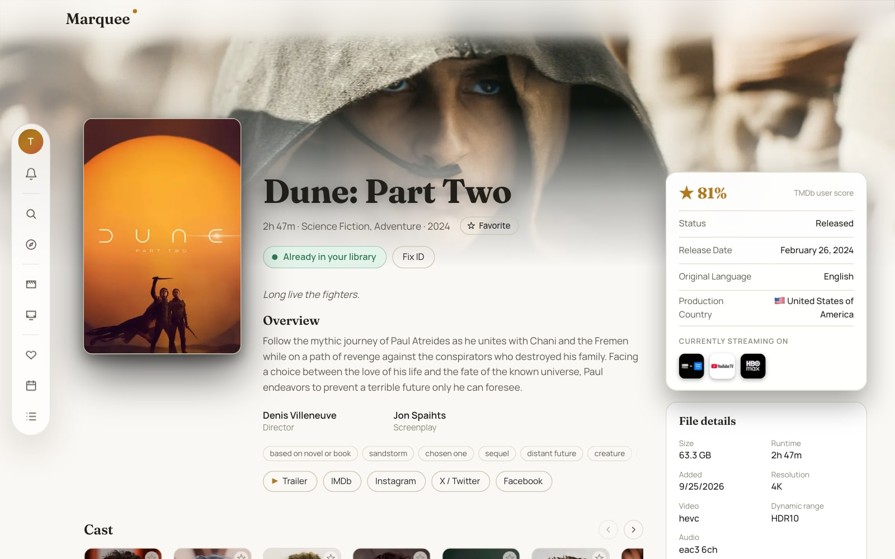
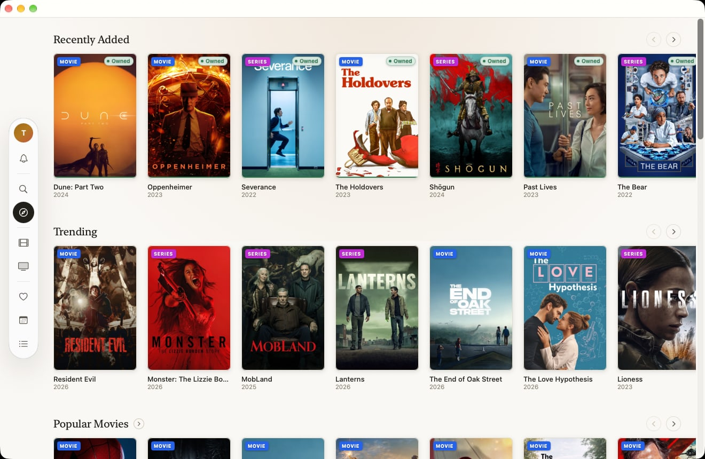

<p align="center">

</p>
<h1 align="center">Marquee</h1>
<p align="center">
<a href="https://github.com/TimmyAmant/marquee/actions/workflows/ci.yml"></a>
<a href="https://github.com/TimmyAmant/marquee/releases/latest"></a>
<a href="https://hub.docker.com/r/timmyamant/marquee"></a>
<a href="https://github.com/TimmyAmant/marquee/blob/main/LICENSE"></a>


</p>

**Marquee** is a free and open source, self-hosted app for requesting movies and
shows **and** knowing exactly what you already have. It works with
[Plex](https://plex.tv), [Jellyfin](https://jellyfin.org) and
[Emby](https://emby.media) — even two at once — and with
**[Sonarr](https://sonarr.tv)** and **[Radarr](https://radarr.video)**, as many
servers as you run, 4K included. Use it in any browser, on your phone, or in the
native **Mac** and **Windows** apps.

<p align="center">

</p>

## Current Features

**Requests**
- Request whole titles, single seasons or 4K; members can edit or cancel while it's pending.
- Approve or decline from the Requests page — or straight from the push notification.
- Per-member permission switches, request limits, auto-approve, a trusted-member preset and a blocklist.
- Comment threads on requests and problem reports; "Report a problem" with search-again.
- **Can't find** alerts when Sonarr/Radarr still hasn't found a release, and a retry when it's unreachable.
- Plex Watchlist and Trakt lists that keep requesting automatically.

**Your library, not just a search box**
- Live status on every poster in the same colors as Radarr and Sonarr — owned, downloading, missing, not monitored, coming soon.
- A **Library** page with everything in Plex, Jellyfin, Sonarr and Radarr in one grid or table: filter by type, status, server, resolution, HDR, codec, genre and year; sort by date added, title, year, size or rating; search; Search now and monitoring on every row.
- File details on every title: resolution, codec, HDR, audio, size and where it lives.
- Collections you only partly own, with **Add all** / **Request all missing** — on each title and all together on the Library page.
- **Duplicates** (a title on several servers or in several files) and a **Storage** card: free space per root folder and a "full in N days" forecast.
- **Fix ID** for titles matched wrongly, Search now and monitoring without opening Sonarr/Radarr.
- A release **calendar** from Sonarr and Radarr.

**Everyone signs in their way**
- Local accounts, **Plex**, **Jellyfin / Emby** (with Quick Connect), and **single sign-on** (Authentik, Authelia, Pocket ID, Keycloak, Google…).
- Import household members from Plex or Jellyfin; optional self sign-up.

**Notifications**
- In-app bell, Web Push, and live alerts in the Mac and Windows apps.
- Discord, ntfy, Telegram, Pushover, email and webhooks — for the household *and* for each person, with their own event choices.

**And**
- A customizable **Discover** page: reorder rows and add your own (a keyword, studio, network, genre or list).
- Share a title with someone in the household or anywhere else.
- Five languages, a "What's new" note after every update, and a menu that sits left, right, top or bottom.
- API keys, an OpenAPI description at `/api-docs`, and a widget summary for Homepage and Homarr.
- One Docker image with its database inside; migrations run on every start.

## Why Marquee

| | Marquee | Typical request apps |
|---|:---:|:---:|
| Plex **and** Jellyfin/Emby at the same time | ✅ | one server |
| File quality (4K, HDR, codec, audio) on every title | ✅ | ❌ |
| One library view across all your servers, with duplicates and a disk-space forecast | ✅ | ❌ |
| Release calendar | ✅ | ❌ |
| Fix a wrong match, Search now, monitoring toggle | ✅ | ❌ |
| Approve or decline from the notification | ✅ | ❌ |
| "Can't find" alerts after approval | ✅ | ❌ |
| Native Mac and Windows apps | ✅ | ❌ |

## Getting Started

```bash
docker pull timmyamant/marquee:latest
```

Or search **marquee** in Unraid's Apps tab. The
**[Getting started guide](docs/getting-started.md)** covers Docker Compose,
Unraid, the Mac and Windows apps, remote access and development.

## Preview

| Title page | Light theme |
|---|---|
|  |  |
|  |  |

## Coming from Overseerr, Jellyseerr or Seerr?

Marquee runs happily next to them, so you can try it without switching anything
off: point it at the same Plex/Jellyfin/Emby and Sonarr/Radarr, import your
household from Plex or Jellyfin, and let people sign in with the accounts they
already have.

When you're ready to switch, **Settings › Integrations › Import from Seerr**
brings everything over from the running Seerr's API with its admin key:
accounts (matched to existing ones by Plex/Jellyfin id, email or username),
permissions and request limits, every request with its seasons and 4K flag,
problem reports with their comments, and the blocklist. Preview first, run
with progress, download a report; run it again later and it only picks up
what's new. See [`docs/migrating-from-seerr.md`](docs/migrating-from-seerr.md).

## API Documentation

Every install serves its API description at `http://<your-server>:3000/api-docs`
(and `/api/v1/openapi.json`). The full reference is
[`docs/api-v1.md`](docs/api-v1.md); dashboards and scripts use
[admin-issued API keys](docs/integrations.md).

## Support

- Read the [Getting started guide](docs/getting-started.md) and the in-app Help first.
- Bug reports and feature requests: [GitHub Issues](https://github.com/TimmyAmant/marquee/issues).
- Locked out? See [resetting the admin password](docs/getting-started.md#locked-out).

## Contributing

Pull requests are welcome. Want Marquee in your language? See
[`docs/translating.md`](docs/translating.md).

> **Beta.** Marquee is young and moves fast. Back up your database before
> updating, and [open an issue](https://github.com/TimmyAmant/marquee/issues) if
> something breaks.

## License

[MIT](LICENSE)
