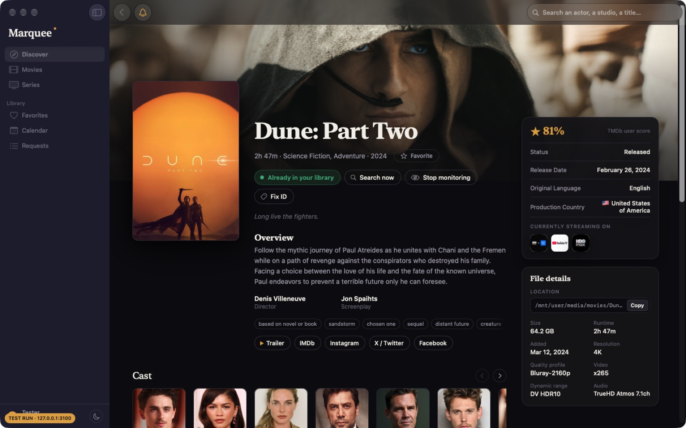

# Marquee for Mac

A native macOS client for [Marquee](../README.md), the self-hosted media dashboard, living in this repo alongside the server it talks to. It uses the server's `/api/v1` HTTP API, so it shows the same data the website does, in a real Mac app.



The app holds no library of its own. There's no database, no syncing, no webhook listener and no job scheduler on this side: your server already does all of that, and the Mac app reads and writes through the API.

## Requirements

- macOS 15 Sequoia or later
- A Marquee server running **0.22.0 or later**, reachable from this Mac
- Xcode 16 or later (built against Xcode 27)
- [XcodeGen](https://github.com/yonaskolb/XcodeGen) (`brew install xcodegen`) — the Xcode project isn't committed, it's generated from `project.yml`

## Installing

Each [release](https://github.com/TimmyAmant/marquee/releases/latest) has a **Marquee.dmg** (universal, built by `.github/workflows/apps.yml`): open it and drag **Marquee** onto the Applications folder beside it. It isn't notarized, so the first time you open it macOS says it can't check it for malicious software: choose **Done**, then **System Settings → Privacy & Security → Open Anyway**. That's once per install. (The release's `Marquee-mac.zip` and its `.sha256` are for the app's own updater.)

### Updating

Marquee checks GitHub for a newer release ten seconds after it opens and then once a day, and **Marquee → Check for Updates…** asks straight away. When there is one, the navigation menu and **Settings → About** offer **Update**: the app downloads the zip, checks its size and SHA-256 against what GitHub lists, unpacks it, makes sure it's a correctly signed Marquee of the right version, then quits and reopens as the new version. It needs to be in a folder you can write to (Applications is fine), not opened straight from Downloads or a disk image.

Because the app replaces itself, it runs outside the App Sandbox (from 0.29). The first launch of 0.29 brings the sandboxed version's settings across. After an update you sign in once more: the builds are ad-hoc signed, and macOS only lets the exact build that saved a login-Keychain item read it back (a Developer ID signature would carry the sign-in across updates).

## Building

```bash
cd mac
xcodegen generate          # writes Marquee.xcodeproj from project.yml
open Marquee.xcodeproj     # then ⌘R in Xcode
```

Or from the command line:

```bash
xcodebuild -project Marquee.xcodeproj -scheme Marquee -configuration Debug build
xcodebuild -project Marquee.xcodeproj -scheme Marquee test
```

Signing is set to **Sign to Run Locally** (`CODE_SIGN_IDENTITY = "-"`), so no Apple Developer account is needed to build and run on your own Mac. To distribute the app, set your team in `project.yml` and switch to Developer ID signing.

## First run

1. **Find your server.** Launch Marquee and press **Search my network** — it scans your local subnet for a Marquee server (macOS asks for Local Network permission the first time). If you'd rather not scan, choose **Enter address manually** and type the host, e.g. `192.168.1.35:3000` or `marquee.local`.
2. **Sign in** with your Marquee username and password. The first account on a brand-new server is created here instead, as the admin.
3. That's it. Everything else — TMDb, Plex, Jellyfin, Sonarr, Radarr, Trakt and the rest — is configured on the server, and **Settings (⌘,) → Integrations** edits it in place.

Your session token is kept in the login Keychain, one item per server (and per build of the app; see Updating), so the app stays signed in across launches. **Marquee → Change Server…** moves to a different server; **Sign Out** revokes just this Mac's token.

## What the app does

| Screen | Server endpoint |
|---|---|
| Discover | `GET /discover` |
| Movies / Series grids | `GET /movies`, `/series` (+ `/extras`), `POST /surprise` |
| Search (results and the header type-ahead) | `GET /search`, `/search/suggest` |
| Title page | `GET /titles/{type}/{id}` (+ `/status`, `/seasons/{n}`) |
| Add, search now, monitor, relink | `POST …/add`, `…/search`, `PUT …/monitored`, `POST …/relink` |
| Requests (member's own, admin queue, history) | `GET /requests/mine`, `/pending`, `/history`; `POST …/approve`, `…/manual-approve`, `…/reject`, `/approve-all` |
| Favorites and every star | `GET /favorites`, `PUT`/`DELETE /favorites/{type}/{id}` |
| Person / Studio pages | `GET /people/{id}`, `/companies/{id}` |
| Calendar | `GET /calendar?month=` |
| Notifications bell, banners and Dock badge | `GET /notifications/stream`, `/badges`, `/notifications` |
| Settings → Account & members | `GET /me`, `GET`/`POST`/`PATCH`/`DELETE /users`, `GET`/`PUT`/`DELETE /users/{id}/avatar` |
| Settings → Integrations | `GET /settings/integrations` and each provider's own endpoint |
| Settings → Activity / Jobs / About | `GET /settings/activity`, `/settings/jobs`, `/settings/about` |
| Help → Error Reference / Releases | `GET /help/errors`, `/changelog` |

Mac-specific additions: system notification banners and a Dock badge for unread notifications, `marquee://` deep links (`marquee://title/movie/603`), menu commands with keyboard shortcuts (⌘1–⌘6 sections, ⌘R reload, ⇧⌘R sync now, ⇧⌘E surprise me), and a light/dark appearance override.

Notifications come straight from your Marquee server, with no outside push service: `LiveUpdates` keeps `GET /notifications/stream` (Server-Sent Events) open and turns each new notification into a system banner the moment it's created, reconnecting after a drop (5 seconds, doubling to a minute). `GET /badges` is still polled once a minute (and on app activation) to drive the badges and as a safety net. After signing in, the app asks "Get notifications on this Mac?" before macOS's own permission prompt; the answer is kept per server and account and can be changed under Settings → Account → Notifications.

## Project layout

```
MarqueeMac/
├── project.yml                 XcodeGen spec (targets, signing, Info.plist)
├── Marquee.xcodeproj           generated
├── Marquee/
│   ├── App/                    @main app, scenes, menu commands, AppModel (session + navigation), Updates/ (the updater)
│   ├── Connection/             finding a server, signing in, the bearer token, APIClient, APIError
│   ├── API/                    the typed /api/v1 facade, its DTOs, ServerEvents, LiveUpdates
│   ├── Core/                   Format/Quality/TitleMeta, the Keychain helper, URL building
│   ├── DesignSystem/           Theme tokens, poster cards, badges, buttons, image loading
│   ├── Features/               one folder per screen
│   └── Resources/              Info.plist, asset catalog
├── MarqueeTests/               DTO fixtures, request shapes, connection/session logic, live contract
├── Docs/API_V1_CORE.md        discovery + sign-in contract (full API: ../docs/api-v1.md)
└── Scripts/local-server.sh     a disposable server for the live tests
```

## Tests

```bash
xcodebuild -project Marquee.xcodeproj -scheme Marquee test
```

`LiveContractTests` additionally exercises every endpoint against a real server. It skips itself unless one is configured, and it writes data, so point it at a throwaway server rather than your own:

```bash
Scripts/local-server.sh up      # disposable server on 127.0.0.1:3100
TEST_RUNNER_MARQUEE_LIVE_URL=http://127.0.0.1:3100 \
TEST_RUNNER_MARQUEE_LIVE_USER=tester TEST_RUNNER_MARQUEE_LIVE_PASSWORD=correct-horse-battery \
TEST_RUNNER_MARQUEE_LIVE_MEMBER_USER=member TEST_RUNNER_MARQUEE_LIVE_MEMBER_PASSWORD=correct-horse-battery \
  xcodebuild -project Marquee.xcodeproj -scheme Marquee test
Scripts/local-server.sh down
```

### Running the app against a throwaway server

For manual or automated UI checks, pin the launch to one host so a stray click can't reach the server this Mac normally uses. A pinned launch ignores the saved server, keeps its token in memory instead of the Keychain, refuses to switch servers, and shows a **TEST RUN · host** badge:

```bash
MARQUEE_PINNED_SERVER=http://127.0.0.1:3100 \
MARQUEE_PINNED_TOKEN=<token from /auth/login> \
  build/DerivedData/Build/Products/Debug/Marquee.app/Contents/MacOS/Marquee
```

Environment variables don't survive `open`, so run the binary directly.

## License

MIT.
